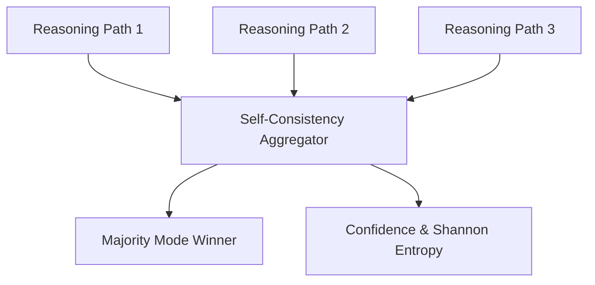

# genpark-self-consistency-majority-voting-aggregator-skill

Wang et al. Self-Consistency majority voting aggregator computing consensus answers, vote distributions, and Shannon entropy over multi-path reasoning outputs.

## Architecture

## Features
- **Entropy Calculation**: Quantifies disagreement uncertainty across sampled paths.
- **Pure Python**: 100% standard library.
